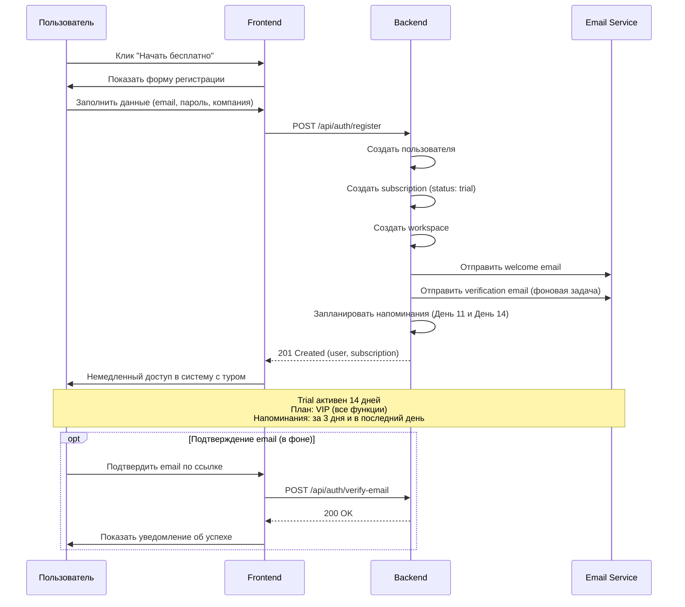
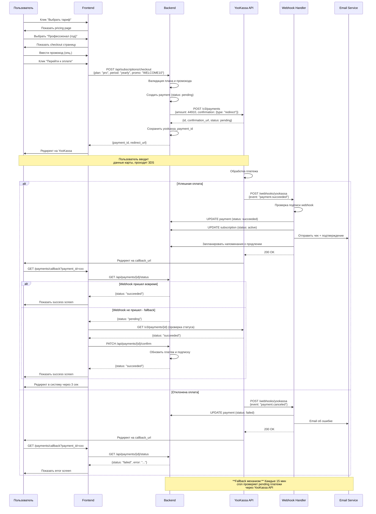
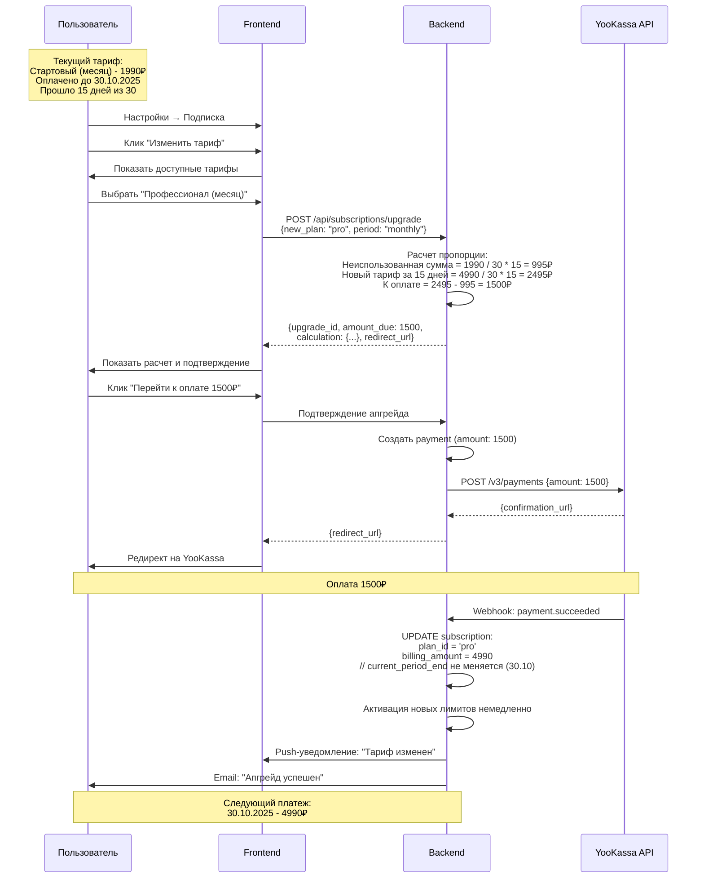
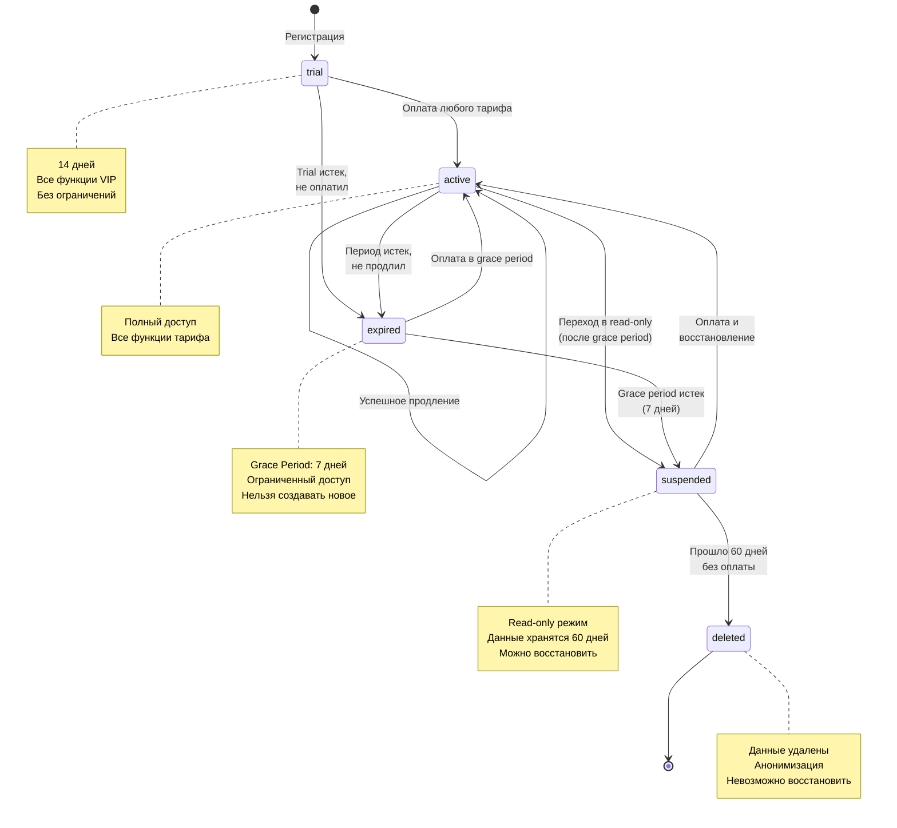

# Воркфлоу выбора и оплаты подписки AniCRM

## Содержание

1. [Обзор системы](#обзор-системы)
2. [Тарифная сетка](#тарифная-сетка)
3. [Процессы и диаграммы](#процессы-и-диаграммы)
4. [Сценарии использования](#сценарии-использования)

---

## Обзор системы

### Ключевые принципы

- ❌ **Нет автопродления** - все платежи производятся вручную
- 💳 **Оплата через YooKassa** - редирект на защищенную страницу
- ⏰ **Система напоминаний** - за 3 дня и в день окончания
- 🎁 **Grace Period** - 7 дней ограниченного доступа после истечения

### Технологический стек

- **Платежный шлюз:** YooKassa API
- **Уведомления:** Email

---

## Тарифная сетка

### Trial (Пробный период)

- **Длительность:** 14 дней бесплатно
- **Функционал:** Все функции тарифа "VIP"
- **Лимиты:** Без ограничений
- **Цель:** Дать попробовать максимум возможностей

### Стартовый

**Цена:** 1 990₽/месяц, 19 900₽/год (скидка 17%)

**Возможности:**

- До 3 пользователей
- До 100 клиентов
- До 10 активных мероприятий/месяц
- Базовая аналитика
- Email поддержка (48 часов)

### Профессионал ⭐ (Most Popular)

**Цена:** 4 990₽/месяц, 49 900₽/год (скидка 17%)

**Возможности:**

- До 10 пользователей
- Неограниченно клиентов
- Неограниченно мероприятий
- Расширенная аналитика и отчеты
- Приоритетная поддержка (24 часа)
- Шаблоны документов

### VIP

**Цена:** 9 990₽/месяц, 99 900₽/год (скидка 17%)

**Возможности:**

- Все из "Профессионал"
- До 50 пользователей
- Приоритетная разработка фич
- Поддержка 24/7

**Важно:** Все цены указаны в рублях. Оплата через российский платежный шлюз YooKassa.

---

## Процессы и диаграммы

### 1. Регистрация и активация триала

### 2. Выбор тарифа и оплата через YooKassa

### 3. Окончание подписки и продление (без автопродления)

```mermaid
sequenceDiagram
    participant C as Cron Jobs
    participant B as Backend
    participant E as Email Service
    participant U as Пользователь
    participant F as Frontend
    
    Note over C,U: Подписка активна до 30.09.2026
    
    rect rgb(66, 0, 6)
        Note over C,E: За 3 дня (27.09.2026)
        C->>B: SELECT subscriptions<br/>WHERE current_period_end = NOW() + 3 days
        B->>E: Email: "Последние дни подписки"
        E->>U: Получить email
        F->>U: Красный баннер: "🔴 3 дня до блокировки"
    end
    
    rect rgb(66, 0, 6)
        Note over C,E: В день окончания (30.09.2026)
        C->>B: SELECT subscriptions<br/>WHERE current_period_end = CURRENT_DATE
        B->>E: Email: "Сегодня последний день"
        E->>U: Получить срочный email
    end
    
    alt Пользователь оплачивает до конца дня
        U->>F: Клик "Продлить подписку"
        Note over U,E: Процесс оплаты<br/>(см. диаграмму №2)
        B->>B: UPDATE subscription<br/>(продлить на новый период)
    else Не оплатил - начинается Grace Period
        rect rgb(66, 0, 6)
            Note over C,B: 01.10.2026 00:00
            C->>B: UPDATE subscription<br/>status = 'expired'<br/>access_level = 'limited'<br/>grace_period_ends_at = +7 days
            B->>E: Email: "Подписка истекла. 7 дней льготного периода"
            E->>U: Получить уведомление
            B->>F: Показать в системе ограниченный режим
            
            Note over U,F: Ограниченный режим Grace Period:<br/>✓ Просмотр всех данных<br/>✓ Редактирование существующих клиентов/мероприятий<br/>✓ Добавление контактов к клиентам<br/>✗ Создание новых клиентов<br/>✗ Создание новых мероприятий<br/>✗ Импорт/экспорт данных
        end
        
        rect rgb(66, 0, 6)
            Note over C,B: 08.10.2026 - конец Grace Period
            C->>B: UPDATE subscription<br/>status = 'suspended'<br/>access_level = 'read_only'
            B->>E: Email: "Доступ ограничен до read-only"
            E->>U: Получить предупреждение
            
            Note over U,F: Read-only режим:<br/>✓ Просмотр всех данных<br/>✓ Экспорт данных<br/>✗ Любые изменения<br/>Данные сохраняются 60 дней
        end
        
        rect rgb(66, 66, 6)
            Note over C,B: 07.12.2026 - удаление данных
            C->>B: UPDATE subscription<br/>status = 'deleted'
            B->>B: Анонимизация/удаление данных
            B->>E: Email: "Данные удалены"
        end
    end
```

### 4. Апгрейд тарифа с пропорциональным перерасчетом

### 5. Даунгрейд тарифа (запланированный)

```mermaid
sequenceDiagram
    participant U as Пользователь
    participant F as Frontend
    participant B as Backend
    participant C as Cron Jobs
    participant E as Email Service
    
    Note over U: Текущий тариф:<br/>Профессионал (год) - 49900₽<br/>Оплачено до 30.06.2026<br/>Осталось 9 месяцев
    
    U->>F: Настройки → Подписка
    U->>F: Клик "Изменить тариф"
    F->>U: Показать доступные тарифы
    
    U->>F: Выбрать "Стартовый (месяц)"
    F->>B: POST /api/subscriptions/downgrade/check<br/>{new_plan: "starter", period: "monthly"}
    
    B->>B: Проверка текущего usage:<br/>• 8 активных пользователей (лимит нового: 3)<br/>• 245 клиентов (лимит: 100)
    
    B-->>F: {can_downgrade: false,<br/>blocking_issues: [...]}<br/>
    
    F->>U: ⚠️ Предупреждение:<br/>"Деактивируйте 5 пользователей"<br/>"Архивируйте 145 клиентов"<br/><br/>💰 Возврат не производится<br/>Переход с 01.07.2026
    
    U->>F: Деактивировать лишних пользователей
    U->>F: Архивировать клиентов
    
    U->>F: Клик "Запланировать переход"
    F->>B: POST /api/subscriptions/downgrade/schedule
    
    B->>B: Повторная проверка лимитов
    B->>B: INSERT scheduled_subscription_changes:<br/>effective_date = current_period_end + 1 day
    
    B-->>F: {scheduled_change_id, effective_date}
    B->>E: Email: "Даунгрейд запланирован на 01.07.2026"
    
    F->>U: ✓ "Переход запланирован"<br/>[Отменить запланированное изменение]
    
    Note over U,C: Пользователь продолжает использовать<br/>Профессионал до 30.06.2026<br/>Все даты: Московское время (MSK, UTC+3)
    
    rect rgb(66, 66, 6)
        Note over C,E: 01.07.2026 в 01:00
        C->>B: SELECT scheduled_subscription_changes<br/>WHERE effective_date = CURRENT_DATE
        
        C->>B: Финальная проверка лимитов
        
        alt Лимиты соблюдены
            B->>B: UPDATE subscription:<br/>plan_id = 'starter'<br/>billing_period = 'monthly'<br/>billing_amount = 1990
            
            B->>B: Применить новые лимиты
            B->>E: Email: "Тариф изменен на Стартовый"
            B->>E: Email: "Напоминание об оплате"
            B->>F: Показать уведомление о смене тарифа
        else Лимиты превышены
            B->>B: UPDATE scheduled_change<br/>status = 'cancelled'
            B->>E: Email: "Даунгрейд отменен.<br/>Превышены лимиты."
            B->>F: Уведомление об отмене
            Note over B: Пользователь остается<br/>на старом тарифе
        end
    end
```

### 7. Статусы подписки (State Machine)

---

## Сценарии использования

### UC-1: Регистрация нового пользователя с триалом

**Актор:** Новый пользователь (владелец event-агентства)

**Предусловия:** Пользователь находится на лендинге AniCRM

**Основной сценарий:**

1. Пользователь кликает "Начать бесплатно"
2. Заполняет форму регистрации (email, пароль, название компании)
3. Немедленно получает доступ в систему
4. Проходит онбординг с туром по системе
5. Получает полный доступ на 14 дней (тариф "VIP")
6. Получает письмо с подтверждением email (опционально)

**Постусловия:**

- Создан пользователь и workspace
- Активен триал на 14 дней
- Запланированы напоминания о конце триала

**Альтернативные сценарии:**

- **1a.** Email уже зарегистрирован → показать ошибку, предложить войти
- **1b.** Невалидный email → ошибка валидации в реальном времени
- **6a.** Не подтвердил email за 24 часа → повторное письмо (без блокировки доступа)

**Важно:** Все временные операции выполняются по московскому времени (MSK, UTC+3).

---

### UC-2: Выбор и оплата тарифа после триала

**Актор:** Пользователь на триале

**Предусловия:**

- Триал активен
- Осталось менее 3 дней до окончания

**Основной сценарий:**

1. Пользователь получает email "Триал заканчивается через 3 дня"
2. Видит баннер в системе "Trial: осталось 3 дня"
3. Кликает "Выбрать тариф"
4. Выбирает период оплаты (месяц/год)
5. Выбирает тариф "Профессионал (год)"
6. Видит checkout страницу с расчетом (49 900₽)
7. Применяет промокод WELCOME10 (-4 990₽)
8. Кликает "Перейти к оплате"
9. Редиректится на страницу YooKassa
10. Вводит данные карты, проходит 3DS
11. Успешно оплачивает
12. Возвращается на callback страницу
13. Видит success screen "Оплата прошла успешно"
14. Получает email с чеком
15. Автоматически переводится на оплаченный тариф

**Постусловия:**

- Подписка активна на выбранный период
- Триал завершен
- Запланированы напоминания о продлении

---

### UC-3: Продление истекающей подписки

**Актор:** Пользователь с активной подпиской

**Предусловия:**

- Подписка активна
- До окончания осталось 7 дней

**Основной сценарий:**

1. Пользователь получает email "Подписка заканчивается через 7 дней"
2. Видит баннер в системе "⚠️ Подписка заканчивается через 7 дней"
3. Кликает "Продлить подписку"
4. Попадает на страницу выбора тарифа
5. Может выбрать тот же тариф или изменить
6. Может изменить период оплаты (месяц ↔ год)
7. Подтверждает выбор
8. Процесс оплаты через YooKassa
9. После успешной оплаты подписка продлевается

**Постусловия:**

- Подписка продлена на новый период
- Новый срок окончания установлен
- Запланированы новые напоминания

---

### UC-4: Апгрейд тарифа с пропорциональным перерасчетом

**Актор:** Пользователь на тарифе "Стартовый"

**Предусловия:**

- Активная подписка "Стартовый (месяц)"
- До окончания периода осталось 15 дней

**Основной сценарий:**

1. Пользователь видит уведомление "Достигнут лимит пользователей (3/3)"
2. Переходит в "Настройки → Подписка"
3. Кликает "Изменить тариф"
4. Выбирает "Профессионал (месяц)"
5. Видит расчет пропорции:
    - Неиспользованная сумма: 995₽ (15 дней из 30)
    - Стоимость нового за 15 дней: 2 495₽
    - К оплате: 1 500₽
6. Подтверждает апгрейд
7. Оплачивает 1 500₽ через YooKassa
8. Тариф меняется немедленно
9. Новые лимиты активируются сразу
10. Получает email с подтверждением

**Постусловия:**

- План изменен на "Профессионал"
- Лимиты увеличены
- Дата окончания периода не изменилась
- Следующий платеж: полная стоимость нового тарифа

---

### UC-5: Даунгрейд тарифа (запланированный)

**Актор:** Пользователь на тарифе "Профессионал (год)"

**Предусловия:**

- Годовая подписка оплачена
- Осталось 9 месяцев

**Основной сценарий:**

1. Пользователь переходит в "Настройки → Подписка"
2. Кликает "Изменить тариф"
3. Выбирает "Стартовый (месяц)"
4. Видит предупреждение о потере функций и необходимости деактивации
5. Деактивирует 5 пользователей
6. Архивирует 145 клиентов
7. Кликает "Запланировать переход"
8. Система планирует даунгрейд на дату окончания текущей подписки
9. Получает email с подтверждением

**В дату окончания (автоматически):**

10. Cron job проверяет соответствие лимитам
11. Если OK → применяет даунгрейд
12. Если превышены лимиты → отменяет даунгрейд

**Постусловия:**

- Даунгрейд запланирован или выполнен
- Пользователь уведомлен о результате

---